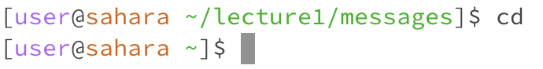
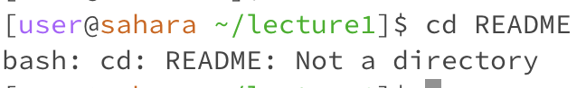
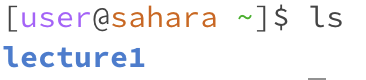
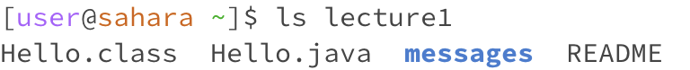
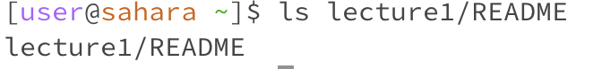
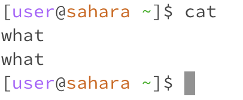
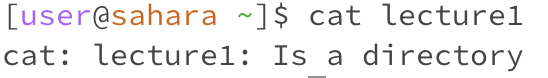
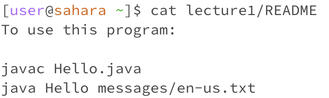

* Working Directory: ```/home```
* Nothing happens since no arguement was passed after cd and there was no change of directory.
* Not an Error


* Working Directory: ```/home```
* The ```cd``` command changes the working directory to ```/home/lecture1```, as indicated by the second line.
* Not an Error


* Working Directory: ```/home/lecture1```
* An error message was printed since ```cd``` requires a path to a directory as its argument.
* It is an error since ```README``` is not a directory


* Working Directory: ```/home```
* The ```ls``` command printed out the contents of the working directory.
* Not an Error


* Working Directory: ```/home```
* The ```ls``` command printed out the contents of the specified directory.
* Not an Error


* Working Directory: ```/home```
* The relative path to the specified file was printed.
* Not an Error


* Working Directory: ```/home```
* The command fails to run, since ```cat``` requires an arguement.
* It is an error; trying to run it without passing an argument causes an error.


* Working Directory: ```/home```
* An error message is printed since a directory was passed in as the argument.
* It is an error, ```cat``` does not work with directories as its argument.


* Working Directory: ```/home```
* The ```cat``` command printed out the contents of the specified file.
* Not an Error
