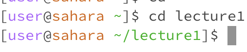

* Working Directory: ```/home```
* Nothing happens, since no arguement was passed after cd and there was no change of directory.
* Not an Error


* Working Directory: ```/home```
* Directory is changed to ```/home/lecture1```, as indicated by the second line
* Not an Error


* Working Directory: ```/home/lecture1```
* An error message was printed.
* It is an error since ```README``` is not a directory


* Working Directory: ```/home```
* The contents of the working directory was printed.
* Not an Error


* Working Directory: ```/home```
* The contents of the specified directory was printed.
* Not an Error


* Working Directory: ```/home```
* The relative path to the file was printed.
* Not an Error


* Working Directory: ```/home```
* The relative path to the file was printed.
* It is an error, ```cat``` requires an argument, trying to run it without passing an argument causes an error.


* Working Directory: ```/home```
* An error message is printed.
* It is an error, ```cat``` does not work with directories as its argument.


* Working Directory: ```/home```
* The contents of the specified file is printed.
* Not an Error
