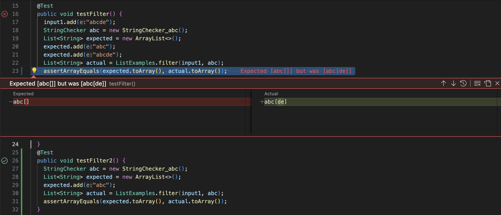

# Lab Report 3 – File Exploration and Text Analysis from the Command Line (Week 5)
***

## Part 1

Failure-Inducing Test Code:
`````
  List<String> input1;
  @Before
  public void setUp(){
    input1 = new ArrayList<>();
    input1.add("abc");
    input1.add("def");
    input1.add("ghi");
  }
	@Test 
	public void testFilter() {
    input1.add("abcde");
    StringChecker abc = new StringChecker_abc();
    List<String> expected = new ArrayList<>();
    expected.add("abc");
    expected.add("abcde");
    List<String> actual = ListExamples.filter(input1, abc);
    assertArrayEquals(expected.toArray(), actual.toArray());
	}

...

class StringChecker_abc implements StringChecker{
  String checkString = "abc";
  public boolean checkString(String s){    return s.contains(checkString);   }
}
`````

Non-Failure-Inducing Test Code:
`````
  List<String> input1;
  @Before
  public void setUp(){
    input1 = new ArrayList<>();
    input1.add("abc");
    input1.add("def");
    input1.add("ghi");
  }
  @Test 
	public void testFilter2() {
    StringChecker abc = new StringChecker_abc();
    List<String> expected = new ArrayList<>();
    expected.add("abc");
    List<String> actual = ListExamples.filter(input1, abc);
    assertArrayEquals(expected.toArray(), actual.toArray());
	}

...

class StringChecker_abc implements StringChecker{
  String checkString = "abc";
  public boolean checkString(String s){    return s.contains(checkString);   }
}
`````

Symptom:


### The Fix
Before:
`````
  static List<String> filter(List<String> list, StringChecker sc) {
    List<String> result = new ArrayList<>();
    for(String s: list) {
      if(sc.checkString(s)) {
        result.add(0, s);
      }
    }
    return result;
  }
`````
After:
`````
  static List<String> filter(List<String> list, StringChecker sc) {
    List<String> result = new ArrayList<>();
    for(String s: list) {
      if(sc.checkString(s)) {
        result.add(s);
      }
    }
    return result;
  }
`````
Before, the method was adding the checked strings to the beginning of the list, when it is required for the strings in the returned list be in the same order as they appear in the list parameter. 
By altering ```result.add(0, s);``` to ```result.add(s);```, the method will now add the strings in the intended order.


## Part 2
### Command less options
Option 1: G

Found from ```man less```.

**Example 1**

Command:
`````
less +G technical/911report/preface.txt
`````
Output:
`````
...
            Thomas H. Kean, chair
            Lee H. Hamilton, vice chair
        
    
(END)
`````

**Example 2**

Command:
`````
less technical/911report/preface.txt
G
`````
Output:
`````
...
            Thomas H. Kean, chair
            Lee H. Hamilton, vice chair
        
    
(END)
`````
The option causes the output to jump to end, so that everything is printed at once. This helps prevent the need to scroll through line by line to reach the end of the file.

Option 2: N

Found from command ```man less```

**Example 3**

Command: 
`````
less -N technical/911report/preface.txt
`````
Output:
`````
      1  
      2     
      3         
      4             PREFACE
      5             We present the narrative of this report and the recommendations that flow from it to
      6                 the President of the United States, the United States Congress, and the American
      7                 people for their consideration. Ten Commissioners-five Republicans and five
      8                 Democrats chosen by elected leaders from our nation's capital at a time of great
      9                 partisan division-have come together to present this report without dissent.
...
`````
**Example 4**

Command: 
`````
less technical/911report/preface.txt
-N
`````
Output:
`````
      1  
      2     
      3         
      4             PREFACE
      5             We present the narrative of this report and the recommendations that flow from it to
      6                 the President of the United States, the United States Congress, and the American
      7                 people for their consideration. Ten Commissioners-five Republicans and five
      8                 Democrats chosen by elected leaders from our nation's capital at a time of great
      9                 partisan division-have come together to present this report without dissent.
...
`````
This brings out the interface with the line numbers. This is an extremely useful ease-of-access feature.

Option 3: --shift

Found from command ```man less```

**Example 5**

Command: 
`````
less --shift 0 technical/911report/preface.txt
/PREFACE
`````
Output (after scolling to the right once):
`````
m it to
merican
...
`````

**Example 6**

Command: 
`````
less --shift 10 technical/911report/preface.txt
`````
Output:
`````
  PREFACE
  We present the narrative of this report and the recommendations that flow from it to
      the President of the United States, the United States Congress, and the American
      people for their consideration. Ten Commissioners-five Republicans and five
      Democrats chosen by elected leaders from our nation's capital at a time of great
...
`````
This option allows for different horizontal scroll steps. 0 is the default option, which is set to half of the screen size. The option is especially useful for this text file because every line within starts with a certain amount of whitespace.

Option 4: --mouse

Found from command ```man less```

**Example 7**

Command:
`````
less --mouse technical/911report/preface.txt
`````
Output:
`````

    
        
            PREFACE
            We present the narrative of this report and the recommendations that flow from it to
                the President of the United States, the United States Congress, and the American
...
`````

**Example 8**

Command:
`````
less --MOUSE technical/911report/preface.txt
`````
Output:
`````

    
        
            PREFACE
            We present the narrative of this report and the recommendations that flow from it to
                the President of the United States, the United States Congress, and the American
...
`````
Although adding ```--mouse``` or ```--MOUSE``` does not change the output, it allows the mouse to be used in the less interface. The difference between the two commands is the direction of scrolling.
