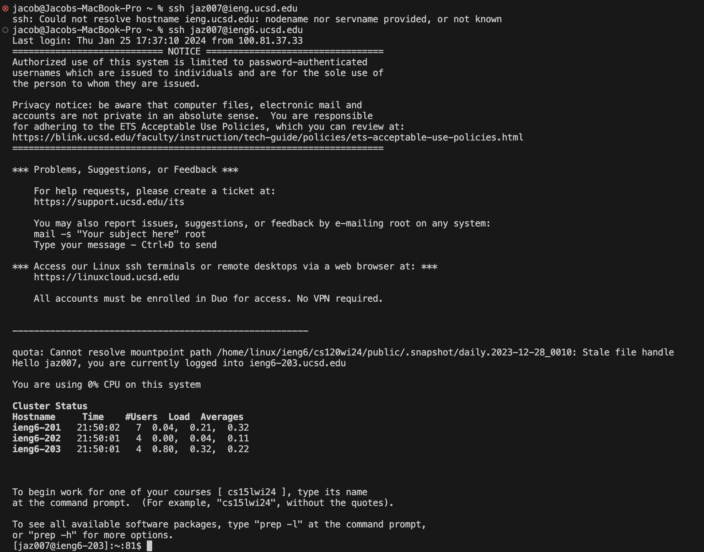
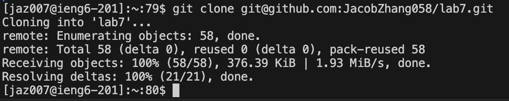
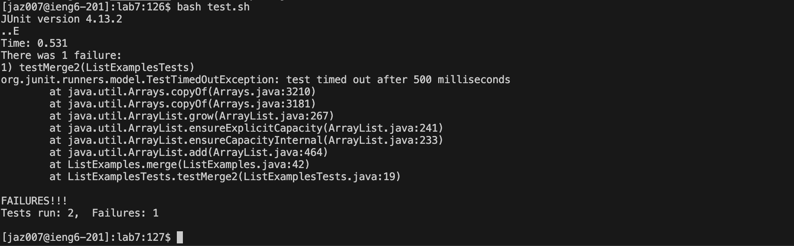
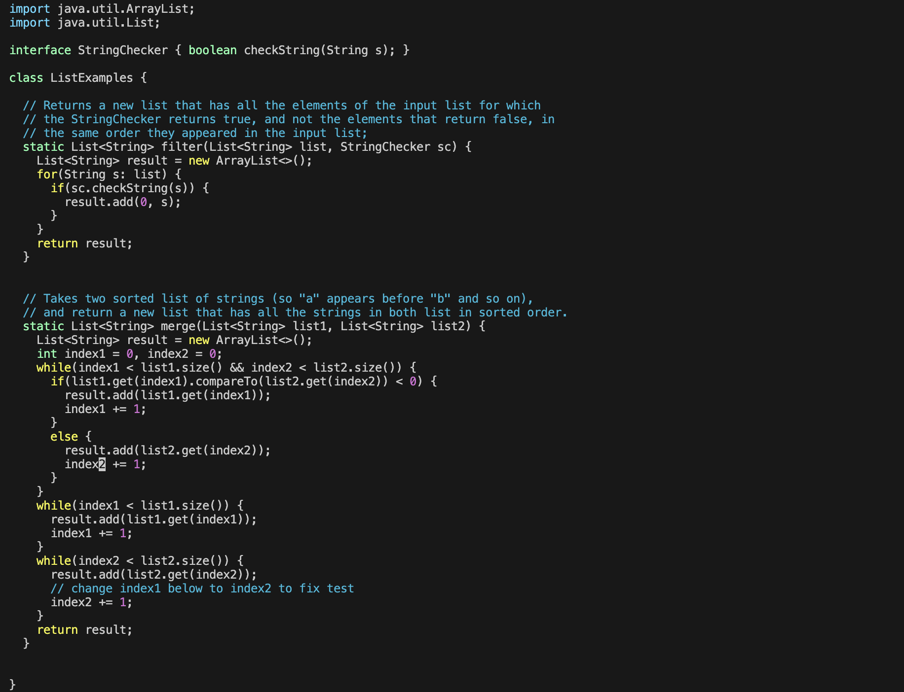
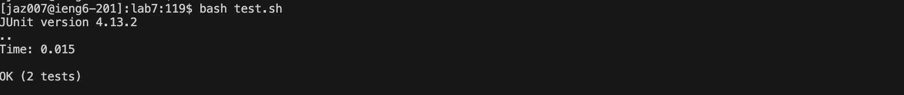
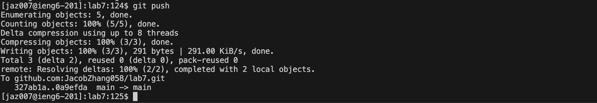
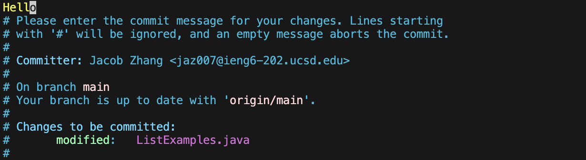

# Lab Report 4 - Doing it All from the Command Line (Week 7)
***

## Step 4

Commands Typed:
```
ssh jaz007@ieng6.ucsd.edu
```
Results:

Explanation:
This allows access to the server where I will run the tests.

## Step 5

Commands Typed:
```
git clone <ctrl+v>
```
Results:

Explanation:
With the link copied, I can just use ``<ctrl+v>`` to paste "git@github.com:JacobZhang058/lab7.git" into the terminal. This command will copy the code from the repository onto the server.

## Step 6

Commands Typed:
```
cd l<tab>
bash t<tab>
```
Results:

Explanation:
Pressing ``<tab>`` autofills the commands with "lab7" and "test.sh", respectively. These two commands will change my directory to the lab7 folder and run the specified bash script, respectively.

## Step 7

Commands Typed:
```
vim L<tab>.<tab>
43jer2:wq!
```
Results:

Explanation:
Again, pressing ``<tab>`` autofills the command. However, since there are two files that start with "L", I need to type ``.`` and then hit ``<tab>`` to specifiy which file I mean.
``43j`` moves the cursor down 43 lines, ``e`` skips to the end of the next word, ``r2`` replaces the character with "2", and finally ``:wq!`` saves and closes the file.

## Step 8

Commands Typed:
```
<up><up>
```
Results:

Explanation:
This calls the second-to-last command entered into the terminal, which happens to be ``bash test.sh``, which I need to run again to re-test the code.

## Step 9

Commands Typed:
```
git add <tab>
git commit
aHello<esc>
:wq!
git push
```
Results:


Explanation:
``git add <tab>`` will automatically update the command with the changed files. ``git add <tab>`` brings up an interface, and ``aHello<esc>`` and ``:wq!`` will save a commit message. Then, ``git push`` pushes the changes.

