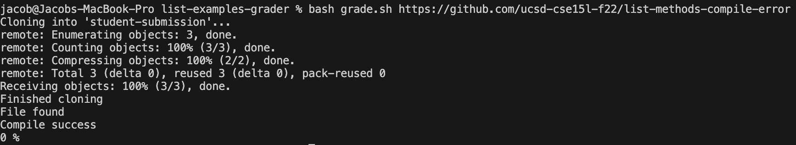

# Lab Report 5 - Putting it All Together (Week 9)
***

## Part 1
1. Hello, I am experiencing some issues with my grading script! It tells me that this file that is supposed to have a compiler error compiles successfully!


2. Hello student. That file is indeed suppoosed to have a compiler error. To confirm this, you can follow the tester script manually: move the java file into the grading area and attempt to compile the junit jar file using the command ``javac``. So, the compiler error exists. What could cause the wrong message to appear? Hint: Identify which print lines were executed and determine if any of the conditionals that led to those print lines have a mistake.

3. Oh I see! The printed line of "Compile success" is based on the conditional, ```if [[   $? -eq 1    ]]```, which must have an error! I looked into it, and the variable "$?" would be equal to 1 in the event of a compiler error. Thus, the conditional is wrong! Thank you, TA!

4. 
Bash Script:
`````
CPATH='.:lib/hamcrest-core-1.3.jar:lib/junit-4.13.2.jar'

rm -rf student-submission
rm -rf grading-area

mkdir grading-area

git clone $1 student-submission
echo 'Finished cloning'


# Draw a picture/take notes on the directory structure that's set up after
# getting to this point

# Then, add here code to compile and run, and do any post-processing of the
# tests

if [[   -f student-submission/ListExamples.java   ]]
then  
    echo "File found"
else
    echo "File not found"
    echo '0 %'
    exit
fi

cp TestListExamples.java grading-area
cp student-submission/ListExamples.java grading-area
cp -r lib grading-area

cd grading-area
javac -cp $CPATH *.java 2> compile-msg.txt

if [[   $? -eq 1    ]]
then
    echo "Compile success"
else
    cat compile-msg.txt
    echo "Compile failed"
    echo '0 %'
    exit
fi


java -cp $CPATH org.junit.runner.JUnitCore TestListExamples > test-results.txt
VAR=$(grep -c 'OK' test-results.txt)

if [[   $VAR -eq 1  ]]
then
    echo '100 %'
else
    tail -n 2 test-results.txt > tests-run-failures.txt
    TESTSRUN=$(grep -Eo "Tests run: [0-9]+" tests-run-failures.txt | grep -Eo "[0-9]+")
    FAILURES=$(grep -Eo "Failures: [0-9]+" tests-run-failures.txt | grep -Eo "[0-9]+")
    let a=100\*$FAILURES/$TESTSRUN
    let a=100-a
    echo $a '%'
fi

exit
`````
Cloned Java file:
`````
import java.util.ArrayList;
import java.util.List;

interface StringChecker { boolean checkString(String s); }

class ListExamples {

  // Returns a new list that has all the elements of the input list for which
  // the StringChecker returns true, and not the elements that return false, in
  // the same order they appeared in the input list;
  static List<String> filter(List<String> list, StringChecker sc) {
    List<String> result = new ArrayList<>();
    for(String s: list) {
      if(sc.checkString(s)) {
        result.add(0, s)
      }
    }
    return result;
  }


  // Takes two sorted list of strings (so "a" appears before "b" and so on),
  // and return a new list that has all the strings in both list in sorted order.
  static List<String> merge(List<String> list1, List<String> list2) {
    List<String> result = new ArrayList<>();
    int index1 = 0, index2 = 0;
    while(index1 < list1.size() && index2 < list2.size()) {
      if(list1.get(index1).compareTo(list2.get(index2)) < 0) {
        result.add(list1.get(index1));
        index1 += 1;
      }
      else {
        result.add(list2.get(index2));
        index2 += 1;
      }
    }
    while(index1 < list1.size()) {
      result.add(list1.get(index1));
      index1 += 1;
    }
    while(index2 < list2.size()) {
      result.add(list2.get(index2));
      index1 += 1;
    }
    return result;
  }


}
`````
Command:
```bash grade.sh https://github.com/ucsd-cse15l-f22/list-methods-compile-error```
The Fix:
In the bash script, change the conditional from ``if [[   $? -eq 1    ]]`` to ``if [[   $? -eq 0    ]]``.


## Part 2
I learned the basics of vim! Although vim is quite clunky to use, especially at first (I've never used ``h`` ``j`` ``k`` ``l`` as direction keys!), it provides the user a text editor through the terminal. This opens a new world of possibilities for what can be done exclusively through the terminal.
