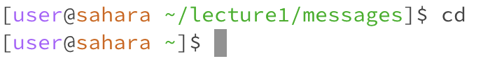

# Lab Report 2 - VSCode and Your Local Machine (Week 3)
***

Code for ChatServer (Built off of NumberServer of Week 2):
```
import java.io.IOException;
import java.net.URI;
import java.util.ArrayList;

class Handler implements URLHandler {
    // The one bit of state on the server: a number that will be manipulated by
    // various requests.
    int num = 0;
    ArrayList<String> users = new ArrayList<>();
    ArrayList<String> messages = new ArrayList<>();

    public String handleRequest(URI url) {
        if (url.getPath().equals("/")) {
            String chatStr = "";
            for(int i = 0; i < users.size(); i++){
                chatStr += users.get(i) + ": " + messages.get(i) + '\n';
            }
            return chatStr;
        } else {
            if (url.getPath().contains("/add-message")) {
                String[] parameters = url.getQuery().split("&");
                String[] user = parameters[1].split("=");
                String[] message = parameters[0].split("=");
                if (message[0].equals("s")&&user[0].equals("user")) {
                    messages.add(message[1]);
                    users.add(user[1]);
                    String chatStr = "";
                    for(int i = 0; i < users.size(); i++){
                        chatStr += users.get(i) + ": " + messages.get(i) + '\n';
                    }
                    return chatStr;
                }
            }
            return "404 Not Found!";
        }
    }
}

class ChatServer {
    public static void main(String[] args) throws IOException {
        if(args.length == 0){
            System.out.println("Missing port number! Try any number between 1024 to 49151");
            return;
        }

        int port = Integer.parseInt(args[0]);

        Server.start(port, new Handler());
    }
}
```

***


* 
* 
